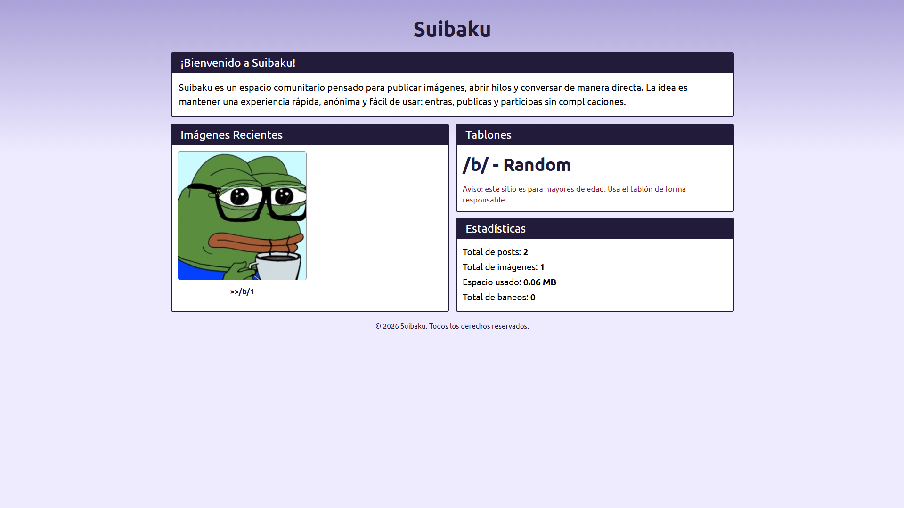
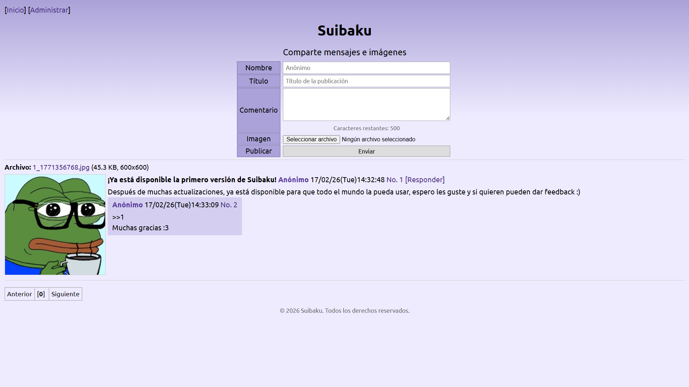
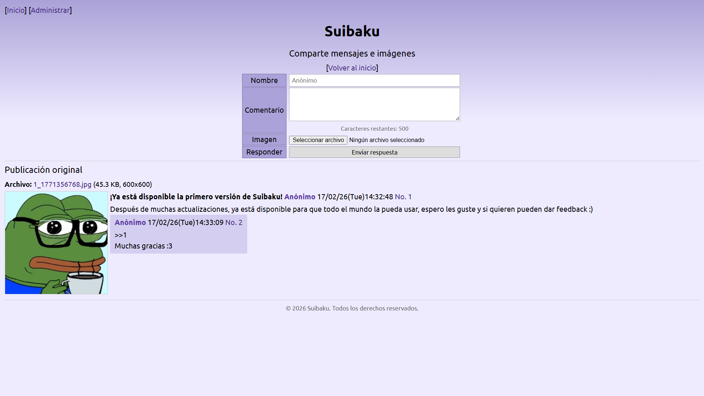
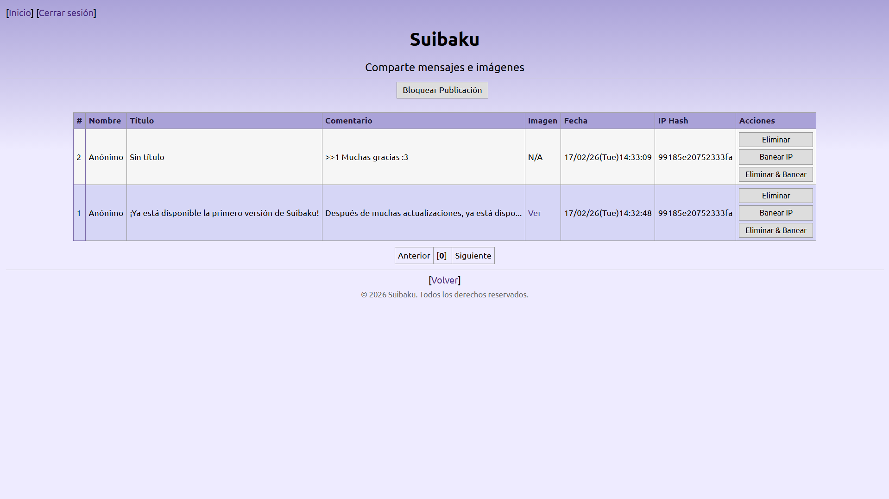

# Suibaku (Mini BBS en PHP)

Suibaku es un imageboard/BBS ligero en PHP con almacenamiento en archivos `.dat`.
Permite crear hilos, responder, subir imágenes y moderar desde un panel de administración.

## Imágenes de ejemplo

Estas son las imágenes incluidas en `samples/`:

<table>
   <tr>
      <td align="center">
         
      </td>
      <td align="center">
         
      </td>
   </tr>
   <tr>
      <td align="center">
         
      </td>
      <td align="center">
         
      </td>
   </tr>
</table>

## Características

- Publicación de hilos con título, comentario e imagen.
- Respuestas por hilo.
- Miniaturas automáticas de imágenes.
- Paginación de hilos.
- Panel de administración en `admin.php`:
  - Login por contraseña.
  - Eliminar publicaciones.
  - Banear IP hash.
  - Eliminar + banear en una acción.
  - Bloquear/desbloquear publicaciones.
  - Cerrar sesión.
- Portada en `index.php` con resumen e imágenes recientes.

## Requisitos

- PHP **7.4 o superior**.
- Extensión GD habilitada en PHP (para miniaturas).

## Estructura del proyecto

- `index.php`: portada del sitio.
- `bbs.php`: flujo público del tablón (hilos, respuestas, publicaciones).
- `admin.php`: panel de administración.
- `src/style.css`: estilos.
- `src/script.js`: scripts del frontend.
- `uploads/`: imágenes y miniaturas subidas.
- `database/posts.dat`: almacenamiento de publicaciones.
- `database/bans.dat`: almacenamiento de baneos (hash de IP).
- `bbs.lock`: archivo de bloqueo de publicación (se crea al bloquear desde admin).

## Instalación rápida (XAMPP)

1. Copia el proyecto en:
   - `C:\xampp\htdocs\BBS`
2. Inicia Apache desde el panel de XAMPP.
3. Abre en navegador:
   - `http://localhost/BBS/index.php`
4. El sistema creará automáticamente `uploads/` y `database/` si no existen.

## Uso

### Público

- Portada: `index.php`
- Tablón: `bbs.php` (redirige/genera `bbs.html` según el estado)
- Hilo: `bbs.php?mode=thread&id=NUMERO`

### Administración

- Panel: `admin.php`
- Desde ahí puedes moderar, bloquear publicaciones y cerrar sesión.

## Configuración principal

La configuración está en la parte superior de `bbs.php`:

- Título/subtítulo del sitio.
- Límites de nombre, título, comentario.
- Cooldown entre publicaciones.
- Tamaño máximo de imagen.
- Extensiones permitidas.
- Contraseña de administración.

## Seguridad (importante)

- **Cambia la contraseña de admin** antes de usar en producción.
- Actualmente la contraseña está definida en `bbs.php` como texto en código.
- Considera mover secretos a variables de entorno o archivo de configuración fuera de la raíz pública.
- Si vas a exponerlo en internet, añade protección adicional (HTTPS, rate limit, hardening de Apache/PHP).

## Notas

- El proyecto usa archivos planos (`.dat`) en lugar de base de datos SQL.
- Si cambias estilos, hazlo preferiblemente en `src/style.css`.
- El panel admin y el flujo público están separados (`admin.php` / `bbs.php`).

## Licencia

No definida aún.
